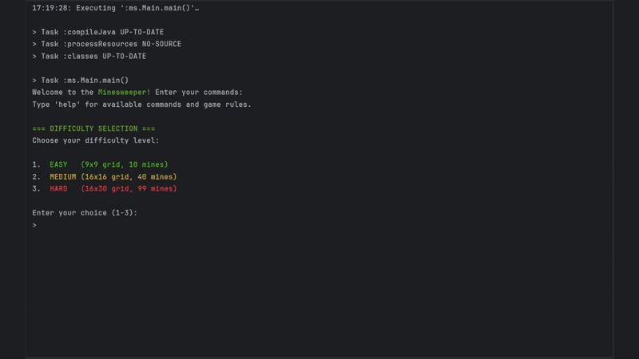

# Minesweeper 2025

## Introduction

This repository contains the implementation of the Minesweeper game, created for the final exam of the Software Development Methods course at the University of Trieste in Autumn 2024. The project was developed using the Java programming language and Test-Driven Development (TDD) techniques taught during the course, with a strong focus on clean and readable code.

## Project Structure

The code is organized into the following packages:

* `ms.commands`: Contains classes for handling and parsing user commands.
* `ms.logic`: Contains the main game logic, including rules and state management.
* `ms.model`: Contains the data model classes.
* `ms.view`: Contains classes for handling the command-line interface (CLI), including input and display management.

## How to Get Started

### Prerequisites

* Java Development Kit (JDK) 17 or higher.

### Running the Game

1.  Clone the repository:
    ```bash
    git clone [https://github.com/minesweeper2025](https://github.com/minesweeper2025)
    ```
2. Build the project using Gradle:
    ```bash
    ./gradlew build
    ```
3. Compile and run the project using the Gradle wrapper:
    ```bash
    ./gradlew run
    ```

## How to Play

The objective of the game is to reveal all cells that do not contain mines. If you reveal a cell with a mine, you lose!

### Commands

* `reveal <row>,<col>`: Reveals a cell at the specified coordinates.
* `flag <row>,<col>`: Toggles a flag on a cell.
* `help`: Displays the help message with commands and rules.
* `reset`: Restarts the current game.
* `quit`: Exits the game.

### Difficulty Levels

* **EASY**: 9x9 grid with 10 mines.
* **MEDIUM**: 16x16 grid with 40 mines.
* **HARD**: 16x30 grid with 99 mines.

## Minesweeper Demo



## Development

This project was developed following the **Test-Driven Development (TDD)** methodology.

The following tools and technologies were used:

* **Java 17**
* **Gradle** for dependency management and project building.
* **JUnit 5** for unit testing.
* **Mockito** for creating mock objects in tests.

During development, great importance was given to **refactoring** to improve the readability and structure of the code and to applying the **S.O.L.I.D.** principles.

## Authors

* Alessio Martucci
* Margherita Necchi
* Giovanni Oro
* Riccardo Samaritan
* Matteo Vicenzino